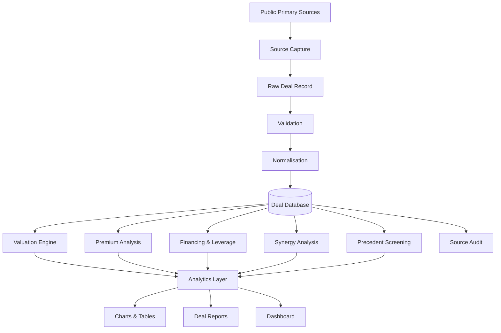
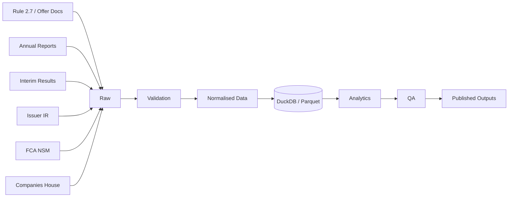
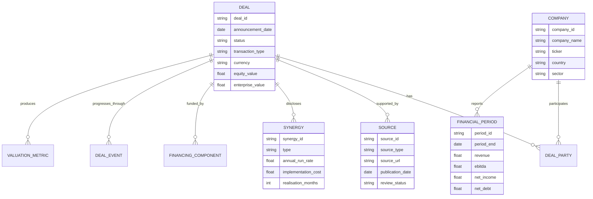

# DealLens
## UK & European M&A Intelligence

> **An independent, source-auditable M&A research platform for analysing announced UK and European transactions, valuation multiples, takeover premiums, financing structures, strategic rationale, synergies, leverage and simplified accretion/dilution.**


---

## Table of Contents

1. [Executive Summary](#executive-summary)
2. [Why DealLens Exists](#why-deallens-exists)
3. [Project Objective](#project-objective)
4. [What DealLens Is — and Is Not](#what-deallens-is--and-is-not)
5. [Investment-Banking Relevance](#investment-banking-relevance)
6. [Core Research Questions](#core-research-questions)
7. [Project Principles](#project-principles)
8. [Scope](#scope)
9. [Outputs](#outputs)
10. [System Architecture](#system-architecture)
11. [Repository Structure](#repository-structure)
12. [Technology Stack](#technology-stack)
13. [Data-Source Hierarchy](#data-source-hierarchy)
14. [Source Provenance and Auditability](#source-provenance-and-auditability)
15. [Deal Inclusion Rules](#deal-inclusion-rules)
16. [Deal Status Taxonomy](#deal-status-taxonomy)
17. [Core Data Model](#core-data-model)
18. [Data Dictionary](#data-dictionary)
19. [Financial Data Methodology](#financial-data-methodology)
20. [Transaction Valuation Methodology](#transaction-valuation-methodology)
21. [Takeover Premium Methodology](#takeover-premium-methodology)
22. [Consideration and Financing Analysis](#consideration-and-financing-analysis)
23. [Synergy Analysis](#synergy-analysis)
24. [Leverage Analysis](#leverage-analysis)
25. [Simplified Accretion/Dilution Model](#simplified-accretiondilution-model)
26. [Comparable Transaction Analysis](#comparable-transaction-analysis)
27. [Strategic Rationale Framework](#strategic-rationale-framework)
28. [Deal-Risk Framework](#deal-risk-framework)
29. [Analytical Dashboard](#analytical-dashboard)
30. [Deal of the Month](#deal-of-the-month)
31. [Deal Report Standard](#deal-report-standard)
32. [Data Pipeline](#data-pipeline)
33. [Validation and Quality Control](#validation-and-quality-control)
34. [Testing Strategy](#testing-strategy)
35. [Configuration](#configuration)
36. [CLI Design](#cli-design)
37. [Example Analytical Workflow](#example-analytical-workflow)
38. [Example Output](#example-output)
39. [Research Extensions](#research-extensions)
40. [Development Roadmap](#development-roadmap)
41. [Definition of Done](#definition-of-done)
42. [GitHub Presentation Standard](#github-presentation-standard)
43. [How I Would Discuss DealLens in an Interview](#how-i-would-discuss-deallens-in-an-interview)
44. [Skills Demonstrated](#skills-demonstrated)
45. [Known Limitations](#known-limitations)
46. [Legal, Licensing and Ethical Use](#legal-licensing-and-ethical-use)
47. [Contributing](#contributing)
48. [Glossary](#glossary)
49. [Primary Reference Sources](#primary-reference-sources)
50. [Disclaimer](#disclaimer)

---

# Executive Summary

**DealLens** is an independent M&A intelligence project designed to answer a simple question:

> **What can public information tell us about how UK and European acquisitions are priced, financed, justified and executed?**

The project converts fragmented public deal information into a structured, reproducible dataset and then applies corporate-finance analysis to it.

Instead of treating an acquisition as a headline such as:

> “Company A agrees to acquire Company B for £4.0bn.”

DealLens breaks the transaction into the questions an analyst should actually ask:

- What is the **equity value** being offered?
- What is the implied **enterprise value**?
- What valuation multiple is the buyer paying?
- What was the target worth before takeover speculation?
- What **premium** is being offered to shareholders?
- Is the transaction funded with **cash, debt, equity or a mixture**?
- What happens to the buyer's leverage?
- What cost and revenue **synergies** have been announced?
- How much of the valuation can those synergies economically justify?
- Is the transaction expected to be **EPS accretive or dilutive**?
- What strategic problem is management trying to solve?
- Which precedents are genuinely comparable?
- What are the principal regulatory, financing, execution and integration risks?
- Did the transaction complete, fail, lapse, get revised, or attract a competing offer?
- How does the deal compare with M&A activity in the same sector and period?

The objective is not to imitate a professional data terminal. It is to demonstrate disciplined analysis using public information, transparent assumptions and reproducible calculations.

The project combines:

- **M&A research**
- **financial statement analysis**
- **valuation**
- **transaction mechanics**
- **capital-structure analysis**
- **data engineering**
- **Python**
- **Excel modelling**
- **written investment-banking-style communication**
- **commercial judgement**

The intended end product is a public repository containing a high-quality transaction database, reproducible analytical code, selected financial models and a series of concise deal reports.

---

# Why DealLens Exists

Public M&A information is abundant but fragmented.

A single transaction may require information from:

- a firm-intention announcement;
- an offer document or scheme circular;
- annual reports;
- interim results;
- investor presentations;
- financing announcements;
- regulatory filings;
- shareholder documents;
- competition-authority decisions;
- target and bidder investor-relations pages;
- market-price data; and
- completion or lapse announcements.

A headline transaction value rarely tells the full story.

Two transactions described as “£2bn deals” can have very different economics because of differences in:

- target net debt;
- pension liabilities;
- non-controlling interests;
- cash acquired;
- consideration structure;
- takeover premium;
- target profitability;
- synergy potential;
- buyer leverage;
- financing costs;
- regulatory risk; and
- transaction certainty.

DealLens therefore treats **data lineage and financial interpretation as equally important**.

Every important numerical output should be answerable with:

1. **Where did this number come from?**
2. **What exactly does it represent?**
3. **What assumptions were made?**
4. **Can another person reproduce it?**
5. **Is it actually comparable with the same metric for another deal?**

---

# Project Objective

The long-term target is a curated dataset of **50–100 announced UK and European M&A transactions**, with sufficient depth to support meaningful cross-sectional analysis.

Each transaction should eventually include:

- transaction identity;
- bidder and target;
- geography;
- sector;
- announcement timeline;
- transaction status;
- offer terms;
- consideration mix;
- equity value;
- enterprise value;
- unaffected share price;
- takeover premium;
- target financials;
- valuation multiples;
- announced synergies;
- transaction financing;
- buyer and target leverage;
- selected accretion/dilution inputs;
- strategic rationale;
- key conditions;
- advisers where publicly disclosed;
- source provenance;
- analyst notes; and
- a final deal outcome.

The purpose is **depth before breadth**.

A smaller dataset with correctly sourced and comparable financial metrics is more valuable than a larger dataset filled with inconsistent values copied from secondary websites.

---

# What DealLens Is — and Is Not

## DealLens is

- A **corporate-finance research project**.
- A **structured M&A dataset**.
- A **valuation-analysis engine**.
- A **transaction-comparison tool**.
- A **source-auditable research workflow**.
- A way to turn public filings into clear financial conclusions.
- A platform for publishing recurring M&A case studies.
- A demonstration of financial, analytical and technical capability.

## DealLens is not

- An investment-advice service.
- A stock-picking engine.
- A merger-arbitrage trading system.
- A replacement for Bloomberg, LSEG, FactSet, Mergermarket or Capital IQ.
- A database claiming complete coverage of European M&A.
- A tool for using confidential, inside or non-public information.
- A repository for republishing copyrighted reports or paid datasets.
- A machine-learning project created merely to make the repository sound more sophisticated.
- A project where an AI model is allowed to invent transaction figures.

The core rule is:

> **If a financial number cannot be sourced or reproduced, it should not appear as fact.**

---

# Investment-Banking Relevance

DealLens is deliberately designed around work associated with investment banking and capital markets.

Deutsche Bank's UK Investment Bank Apprenticeship Programme currently describes possible apprentice work as including:

- industry research;
- monitoring company performance;
- preparing financial-data analysis;
- pitching transactions;
- participating in client calls; and
- refining forecasts.

Source: [Deutsche Bank — Investment Bank Apprenticeship Programme](https://careers.db.com/School-leavers-uk/investment-bank-apprenticeship-programme/)

DealLens is **independent and not affiliated with Deutsche Bank**. The relevance is that its workstreams develop overlapping analytical skills:

| DealLens activity | Banking skill demonstrated |
|---|---|
| Building sector deal screens | Industry research |
| Extracting target financials | Company analysis |
| Calculating transaction multiples | Valuation |
| Analysing funding structure | Capital-structure analysis |
| Modelling leverage | Forecasting / financial analysis |
| Assessing synergies | Transaction analysis |
| Comparing precedents | Deal judgement |
| Writing transaction reports | Communication |
| Maintaining source trails | Accuracy / attention to detail |
| Explaining limitations | Professional judgement |
| Automating repeatable analysis | Process improvement |

The software exists to support the finance work.

**The finance work is the project.**

---

# Core Research Questions

DealLens should be capable of investigating questions such as:

## Valuation

1. How do median acquisition EV/EBITDA multiples differ by sector?
2. How do strategic-buyer multiples compare with financial-sponsor multiples?
3. Are cross-border acquisitions completed at different multiples from domestic acquisitions?
4. Are higher-growth targets associated with higher transaction multiples?
5. Do transactions with larger announced synergies support higher headline valuations?
6. How have transaction multiples changed through different interest-rate environments?

## Premiums

7. What is the median takeover premium to an unaffected share price?
8. Does premium differ by sector?
9. Are hostile or initially unsolicited approaches associated with different premiums?
10. Does the presence of competing bidders increase final consideration materially?
11. Does a longer pre-offer period correlate with higher final premiums?
12. How often is the initial proposal increased?

## Financing

13. How does payment method vary by transaction size?
14. When do bidders prefer cash versus shares?
15. How much leverage do debt-funded acquisitions add to the buyer?
16. Are highly leveraged buyers more likely to use equity consideration?
17. How does refinancing cost alter simplified deal accretion?

## Synergies

18. What proportion of deal value is represented by disclosed annual run-rate cost synergies?
19. Which sectors disclose the largest synergy opportunities relative to target EBITDA?
20. How long do management teams expect synergy realisation to take?
21. How material are one-off implementation costs relative to annual savings?

## Execution

22. What percentage of tracked deals complete?
23. How long does announcement-to-completion take?
24. What are the most common causes of delay?
25. How frequently do competition concerns affect transaction timetables?
26. How often do competing offers emerge?

## Strategic rationale

27. Which strategic motives occur most frequently?
28. Does geographic expansion produce different acquisition multiples from consolidation?
29. Are capability/technology acquisitions priced differently from scale acquisitions?
30. Do announced strategic objectives remain consistent between initial announcement and completion?

These questions are not predetermined conclusions.

The purpose of the project is to build a dataset capable of testing them.

---

# Project Principles

## 1. Primary sources first

Where available, use regulatory filings, official offer documents, audited reports and issuer disclosures before secondary articles.

## 2. Never hide assumptions

If a metric depends on an assumption, record the assumption.

## 3. Reported and calculated values are separate

A figure disclosed by the company must not be silently replaced by a calculated approximation.

## 4. Time matters

Financial and market data must be selected using information that was available at the relevant transaction date.

## 5. Comparability matters

The same label does not guarantee the same economic definition.

For example, “transaction value” can mean different things across announcements.

## 6. Reproducibility matters

The same inputs should produce the same outputs.

## 7. Missing is better than invented

A `NULL` value is preferable to an unsupported estimate.

## 8. Human review remains mandatory

Automated extraction can assist research, but financially material data must be validated against the underlying document.

## 9. Insight should follow evidence

Charts are not conclusions. Every published conclusion should identify the evidence supporting it.

## 10. Professional restraint

The project should look analytical, not promotional. Avoid claims such as “AI-powered institutional-grade M&A platform” unless the functionality genuinely supports them.

---

# Scope

## Geographic scope

Primary focus:

- United Kingdom
- Ireland
- France
- Germany
- Netherlands
- Switzerland
- Spain
- Italy
- Nordics
- other major European markets where source quality is adequate

The first release should prioritise UK public transactions because public-offer documentation can be especially structured and traceable.

## Transaction scope

Primary focus:

- public-company acquisitions;
- recommended cash offers;
- schemes of arrangement;
- contractual offers;
- public-to-private transactions;
- cross-border public acquisitions;
- share-for-share combinations;
- mixed cash-and-share transactions.

Optional later coverage:

- selected private-company acquisitions where adequate financial information exists;
- asset acquisitions;
- carve-outs;
- mergers of equals;
- minority strategic investments.

## Initial exclusions

Unless specifically justified, exclude:

- very small transactions with insufficient disclosure;
- transactions with no reliable valuation basis;
- internal restructurings;
- ordinary asset purchases;
- minority stakes below the project's control threshold;
- rumours with no formal public announcement;
- deals where critical financial information is only available through unlicensed paid data.

---

# Outputs

DealLens has five principal outputs.

## 1. Master transaction dataset

A clean tabular dataset in CSV/Parquet form containing standardised transaction fields.

## 2. Source ledger

A separate record connecting material fields to their underlying public sources.

## 3. Analytical notebooks and scripts

Reproducible analysis covering valuation, premiums, financing, synergies and deal outcomes.

## 4. Financial models

Selected Excel workbooks for:

- transaction valuation;
- leverage;
- synergy analysis;
- simplified accretion/dilution;
- precedent transaction comparison.

## 5. Deal reports

Short, polished case studies translating raw data into an analyst view.

---

# System Architecture



A second representation of the data flow:



---

# Repository Structure

Recommended repository layout:

```text
DealLens/
│
├── README.md
├── pyproject.toml
├── .gitignore
├── .env.example
├── LICENSE
│
├── config/
│   ├── sectors.yml
│   ├── geographies.yml
│   ├── deal_statuses.yml
│   └── source_types.yml
│
├── data/
│   ├── raw/
│   │   ├── deals/
│   │   ├── companies/
│   │   └── market_data/
│   │
│   ├── interim/
│   │   ├── extracted/
│   │   └── reviewed/
│   │
│   ├── processed/
│   │   ├── deals.parquet
│   │   ├── companies.parquet
│   │   ├── financials.parquet
│   │   ├── synergies.parquet
│   │   └── source_ledger.parquet
│   │
│   └── sample/
│       └── example_deals.csv
│
├── src/
│   └── deallens/
│       ├── __init__.py
│       ├── models/
│       │   ├── deal.py
│       │   ├── company.py
│       │   ├── financials.py
│       │   └── source.py
│       │
│       ├── ingestion/
│       │   ├── companies_house.py
│       │   ├── manual_import.py
│       │   └── source_registry.py
│       │
│       ├── cleaning/
│       │   ├── currencies.py
│       │   ├── dates.py
│       │   ├── sectors.py
│       │   └── validation.py
│       │
│       ├── finance/
│       │   ├── valuation.py
│       │   ├── premiums.py
│       │   ├── synergies.py
│       │   ├── leverage.py
│       │   ├── accretion_dilution.py
│       │   └── precedents.py
│       │
│       ├── analytics/
│       │   ├── sector_analysis.py
│       │   ├── premium_analysis.py
│       │   ├── financing_analysis.py
│       │   └── completion_analysis.py
│       │
│       ├── reporting/
│       │   ├── charts.py
│       │   ├── tables.py
│       │   └── deal_report.py
│       │
│       └── cli.py
│
├── notebooks/
│   ├── 01_data_quality.ipynb
│   ├── 02_valuation_overview.ipynb
│   ├── 03_takeover_premiums.ipynb
│   ├── 04_synergy_analysis.ipynb
│   ├── 05_financing_and_leverage.ipynb
│   └── 06_deal_outcomes.ipynb
│
├── models/
│   ├── template_transaction_model.xlsx
│   ├── template_accretion_dilution.xlsx
│   └── template_precedents.xlsx
│
├── reports/
│   ├── deal_of_the_month/
│   └── sector_reviews/
│
├── dashboard/
│   └── app.py
│
├── tests/
│   ├── test_valuation.py
│   ├── test_premiums.py
│   ├── test_synergies.py
│   ├── test_leverage.py
│   ├── test_validation.py
│   └── fixtures/
│
└── docs/
    ├── methodology.md
    ├── data_dictionary.md
    ├── source_policy.md
    ├── deal_report_template.md
    └── changelog.md
```

The public repository should contain **sample or redistributable data only** where licensing is uncertain.

If a source permits access but not republication, the repository should retain:

- the source URL;
- retrieval date;
- the extracted factual field where legally appropriate;
- the transformation logic;

without redistributing the underlying copyrighted document.

---

# Technology Stack

## Core

- **Python 3.12+**
- **pandas** — tabular transformation and analysis
- **DuckDB** — local analytical database
- **PyArrow / Parquet** — efficient columnar storage
- **Pydantic** — schema validation
- **httpx or requests** — permitted API access
- **openpyxl** — Excel interoperability
- **matplotlib** — reproducible chart generation
- **Jupyter** — research notebooks
- **pytest** — unit tests

## Quality tooling

Recommended:

- `ruff`
- `mypy`
- `pre-commit`
- `pytest-cov`

## Optional presentation layer

A lightweight **Streamlit** dashboard can be added after the core research pipeline is reliable.

The dashboard is intentionally secondary.

A visually polished interface cannot compensate for incorrect valuation or inconsistent data.

---

# Data-Source Hierarchy

DealLens follows a source hierarchy.

## Tier A — Regulatory / transaction documents

Preferred for transaction terms.

Examples:

- UK Takeover Code Rule 2.7 firm-intention announcements;
- offer documents;
- scheme circulars;
- regulatory announcements;
- exchange filings;
- competition decisions;
- official completion announcements.

For UK takeovers, Rule 2.7 requires a firm-intention announcement to include the offer terms and identity of the offeror, among other transaction information.

Reference:
[UK Takeover Panel — Rule 2.7](https://code.thetakeoverpanel.org.uk/tp/rules/rule-2/rule-2-7.html)

## Tier B — Audited and formally filed company financial information

Preferred for historic financials.

Examples:

- annual financial reports;
- interim reports;
- audited accounts;
- prospectuses;
- filed results.

The FCA National Storage Mechanism provides access to regulated announcements and documents for UK listed issuers and supports searches across filings.

Reference:
[FCA — National Storage Mechanism](https://www.fca.org.uk/markets/primary-markets/regulatory-disclosures/national-storage-mechanism)

## Tier C — Official issuer investor-relations material

Examples:

- company press releases;
- acquisition presentations;
- investor presentations;
- official earnings releases;
- transaction FAQs.

## Tier D — Government company-register data

Companies House can support identity checks, company-number mapping, filing history and related public company information.

References:

- [Companies House Public Data API](https://developer-specs.company-information.service.gov.uk/companies-house-public-data-api/reference)
- [Companies House API — Getting Started](https://developer-specs.company-information.service.gov.uk/guides/gettingStarted)

## Tier E — Reputable secondary reporting

Use primarily for:

- context;
- market commentary;
- chronology checks;
- finding primary documents.

Examples can include established financial newspapers and newswires.

**Secondary reporting should not replace a primary source for a material transaction term when the primary source is available.**

---

# Source Provenance and Auditability

Every financially material field should be traceable.

A source ledger might contain:

| Field | Description |
|---|---|
| `source_id` | Unique source identifier |
| `deal_id` | Related transaction |
| `entity_id` | Related company if applicable |
| `field_name` | Field supported by the source |
| `source_type` | Rule 2.7, annual report, IR release, etc. |
| `source_title` | Human-readable document title |
| `source_url` | Original source |
| `publication_date` | Source publication date |
| `retrieved_at` | Retrieval timestamp |
| `page_or_section` | Page, paragraph or section reference |
| `reported_value` | Value exactly as interpreted from source |
| `unit` | GBPm, EURm, %, x, etc. |
| `currency` | Original currency |
| `review_status` | Unreviewed / reviewed / verified |
| `review_note` | Any ambiguity or interpretation |
| `source_grade` | A / B / C / D / E |

## Provenance rule

A published metric should be capable of tracing:

```text
Published metric
        ↓
Calculation
        ↓
Normalised input
        ↓
Raw extracted value
        ↓
Primary document
```

Example:

```text
EV / LTM EBITDA = 10.4x
        ↓
£5,200m / £500m
        ↓
EV = £5,200m
LTM EBITDA = £500m
        ↓
Transaction EV from offer announcement
LTM EBITDA reconstructed from FY + interim data
        ↓
Rule 2.7 announcement + target financial statements
```

---

# Deal Inclusion Rules

A transaction can enter the **core comparable dataset** only when it satisfies the minimum standard below.

## Required

- identifiable bidder;
- identifiable target;
- formal announcement date;
- clear transaction type;
- transaction consideration or sufficient data to calculate it;
- deal status;
- geographic classification;
- sector classification;
- at least one primary source.

## Required for valuation-multiple analysis

Additionally:

- usable equity value or enterprise value;
- target revenue and/or EBITDA;
- valid financial period;
- clear currency basis;
- sufficient information to avoid obvious double counting.

## Required for premium analysis

Additionally:

- target was publicly traded;
- offer value per share can be established;
- unaffected share price is identifiable;
- unaffected date and basis are documented.

## Required for synergy analysis

Additionally:

- synergy figure disclosed by management or transaction document;
- synergy type identified;
- currency and timing identified;
- one-off implementation costs recorded where disclosed.

---

# Deal Status Taxonomy

Use a controlled list.

```text
RUMOURED
POSSIBLE_OFFER
FIRM_INTENTION
SHAREHOLDER_APPROVED
REGULATORY_REVIEW
UNCONDITIONAL
COMPLETED
REVISED
COMPETING_OFFER
WITHDRAWN
LAPSED
REJECTED
ABANDONED
```

These statuses should describe the **latest known state**.

A separate status-history table should preserve the transaction timeline.

Example:

| Date | Status | Event |
|---|---|---|
| 2026-01-05 | `POSSIBLE_OFFER` | Bidder identified |
| 2026-01-29 | `FIRM_INTENTION` | Recommended cash offer |
| 2026-03-14 | `SHAREHOLDER_APPROVED` | Scheme approved |
| 2026-04-26 | `UNCONDITIONAL` | Conditions satisfied |
| 2026-05-02 | `COMPLETED` | Acquisition effective |

This prevents the loss of event chronology when the final outcome is recorded.

---

# Core Data Model



---

# Data Dictionary

The following is the target schema, not necessarily the first implementation.

## Deal identity

| Field | Type | Description |
|---|---|---|
| `deal_id` | string | Stable internal identifier |
| `deal_name` | string | Human-readable transaction name |
| `bidder_id` | string | Bidder company ID |
| `target_id` | string | Target company ID |
| `announcement_date` | date | Formal transaction announcement |
| `possible_offer_date` | date/null | Initial possible-offer date |
| `completion_date` | date/null | Effective completion date |
| `status` | enum | Current transaction status |
| `transaction_type` | enum | Scheme, contractual offer, merger, etc. |
| `recommended` | bool/null | Whether target board recommended offer |
| `hostile_or_unsolicited` | bool/null | Whether initially hostile/unsolicited |
| `competing_bid` | bool | Whether competing bidder emerged |
| `cross_border` | bool | Bidder/target primary countries differ |
| `buyer_type` | enum | Strategic / sponsor / consortium / other |
| `target_public` | bool | Whether target was publicly traded |

## Company classification

| Field | Type | Description |
|---|---|---|
| `bidder_country` | string | Bidder primary country |
| `target_country` | string | Target primary country |
| `target_sector` | string | Standard sector |
| `target_subsector` | string | More granular subsector |
| `target_ticker` | string/null | Target listed ticker |
| `bidder_ticker` | string/null | Bidder listed ticker |
| `target_exchange` | string/null | Primary listing |
| `bidder_exchange` | string/null | Primary listing |

## Offer terms

| Field | Type | Description |
|---|---|---|
| `cash_per_share` | decimal/null | Cash consideration per target share |
| `share_exchange_ratio` | decimal/null | Bidder shares per target share |
| `other_consideration_per_share` | decimal/null | Other measurable consideration |
| `implied_offer_price` | decimal/null | Implied per-share value |
| `offer_currency` | string | Offer currency |
| `initial_offer_price` | decimal/null | Initial formal proposal |
| `final_offer_price` | decimal/null | Final consideration |
| `offer_increase_pct` | decimal/null | Increase from initial to final |
| `consideration_type` | enum | Cash / shares / mixed / other |

## Valuation

| Field | Type | Description |
|---|---|---|
| `reported_equity_value` | decimal/null | Equity value stated by source |
| `calculated_equity_value` | decimal/null | Independently calculated equity value |
| `reported_enterprise_value` | decimal/null | EV stated by source |
| `calculated_enterprise_value` | decimal/null | Calculated EV |
| `preferred_ev` | decimal/null | EV selected for analysis |
| `preferred_ev_basis` | string | Why this EV is selected |
| `fully_diluted_shares` | decimal/null | Diluted share count used |
| `net_debt` | decimal/null | Target net debt used |
| `minority_interest` | decimal/null | NCI where relevant |
| `preferred_stock` | decimal/null | Preferred instruments where relevant |
| `non_operating_investments` | decimal/null | Deduction where appropriate |

## Unaffected price and premium

| Field | Type | Description |
|---|---|---|
| `unaffected_price` | decimal/null | Selected pre-offer share price |
| `unaffected_date` | date/null | Date of selected price |
| `unaffected_basis` | string/null | Basis for defining unaffected date |
| `premium_to_unaffected_pct` | decimal/null | Offer premium |
| `premium_to_1m_vwap_pct` | decimal/null | Premium to 1-month VWAP |
| `premium_to_3m_vwap_pct` | decimal/null | Premium to 3-month VWAP |

## Target financials

| Field | Type | Description |
|---|---|---|
| `financial_basis` | enum | LTM / FY / NTM |
| `financial_period_end` | date | Period end |
| `revenue` | decimal/null | Revenue |
| `ebitda` | decimal/null | EBITDA |
| `ebit` | decimal/null | EBIT |
| `net_income` | decimal/null | Net income |
| `cash` | decimal/null | Cash |
| `gross_debt` | decimal/null | Gross debt |
| `net_debt` | decimal/null | Net debt |
| `capex` | decimal/null | Capital expenditure |
| `free_cash_flow` | decimal/null | FCF if calculated |

## Multiples

| Field | Type | Description |
|---|---|---|
| `ev_revenue` | decimal/null | EV / Revenue |
| `ev_ebitda` | decimal/null | EV / EBITDA |
| `ev_ebit` | decimal/null | EV / EBIT |
| `equity_value_net_income` | decimal/null | Equity value / net income |
| `synergy_adjusted_ev_ebitda` | decimal/null | Illustrative EV / (EBITDA + eligible synergies) |

## Synergies

| Field | Type | Description |
|---|---|---|
| `cost_synergies_run_rate` | decimal/null | Annual recurring cost synergies |
| `revenue_synergies` | decimal/null | Revenue synergy disclosure |
| `revenue_synergy_ebitda_equivalent` | decimal/null | Modelled EBITDA contribution |
| `capex_synergies` | decimal/null | Capex savings |
| `one_off_costs` | decimal/null | Implementation cost |
| `synergy_realisation_months` | int/null | Expected timeframe |
| `synergy_tax_rate` | decimal/null | Tax assumption if used |

## Financing

| Field | Type | Description |
|---|---|---|
| `cash_funded` | decimal/null | Existing cash contribution |
| `new_debt` | decimal/null | New debt funding |
| `bridge_facility` | decimal/null | Bridge financing |
| `term_loan` | decimal/null | Term-loan financing |
| `bond_financing` | decimal/null | Bond funding |
| `new_equity` | decimal/null | Equity issuance proceeds |
| `share_consideration_value` | decimal/null | Value issued directly to seller |
| `other_financing` | decimal/null | Other components |
| `incremental_interest_rate` | decimal/null | Modelled cost of new debt |

## Buyer impact

| Field | Type | Description |
|---|---|---|
| `buyer_predeal_net_debt` | decimal/null | Buyer net debt |
| `buyer_predeal_ebitda` | decimal/null | Buyer EBITDA |
| `pro_forma_net_debt` | decimal/null | Combined estimated ND |
| `pro_forma_ebitda` | decimal/null | Combined EBITDA before/after synergy |
| `predeal_leverage` | decimal/null | Buyer ND / EBITDA |
| `pro_forma_leverage` | decimal/null | Combined ND / EBITDA |
| `pro_forma_leverage_with_synergy` | decimal/null | Leverage using eligible synergies |

## Qualitative analysis

| Field | Type | Description |
|---|---|---|
| `primary_rationale` | enum | Main strategic rationale |
| `secondary_rationale` | enum/null | Secondary rationale |
| `management_summary` | string | Neutral summary of stated rationale |
| `analyst_view` | string | Independent interpretation |
| `key_execution_risk` | string | Main risk |
| `regulatory_risk` | enum | Low / medium / high / unclear |
| `integration_complexity` | enum | Low / medium / high / unclear |

---

# Financial Data Methodology

Transaction analysis is highly sensitive to the period used for target financials.

## Preferred basis: LTM

Where data permits, DealLens uses **Last Twelve Months (LTM)** financials ending as close as reasonably possible to the transaction announcement while using information publicly available at the time.

If an annual report and subsequent interim period are available:

\[
LTM = Latest\ FY + Current\ YTD - Prior\ Year\ Comparable\ YTD
\]

Example:

```text
FY revenue                         £1,200m
+ Current H1 revenue                 £700m
- Prior-year H1 revenue              £600m
-------------------------------------------
LTM revenue                        £1,300m
```

The same approach may be used for EBITDA where comparable definitions exist.

## Definition consistency

Do not combine:

- adjusted EBITDA from one period;
- statutory operating profit from another;
- management EBITDA from a presentation;

without explicitly reconciling definitions.

When multiple EBITDA definitions exist, DealLens should record:

- `reported_ebitda`;
- `adjustments`;
- `preferred_ebitda`;
- `preferred_ebitda_basis`.

## FY fallback

If LTM cannot be reconstructed reliably, use the latest completed fiscal-year figure and label the metric:

```text
EV / FY EBITDA
```

not:

```text
EV / LTM EBITDA
```

## NTM

Forward or next-twelve-month estimates should not be included in the core public dataset unless the source is legally redistributable and the estimate methodology is transparent.

---

# Transaction Valuation Methodology

This is one of the most important areas of DealLens.

## Equity value

For a straightforward cash acquisition:

\[
Equity\ Value = Offer\ Price\ Per\ Share \times Fully\ Diluted\ Shares
\]

However, fully diluted share count may require consideration of:

- ordinary shares;
- restricted stock;
- options;
- performance awards;
- convertible securities;
- treasury shares;
- employee share plans.

Whenever a transaction announcement directly reports equity value, record it separately from the calculated figure.

## Enterprise value

A simplified enterprise-value bridge is:

\[
EV =
Equity\ Value
+ Net\ Debt
+ Preferred\ Stock
+ Minority\ Interest
- Non\text{-}Operating\ Investments
\]

The exact bridge depends on the target and transaction disclosure.

### Critical rule

Never treat:

- “transaction value”;
- “equity value”;
- “enterprise value”;

as synonyms.

If the announcement says:

> “The transaction values the company at approximately £3.2bn.”

DealLens must determine what the £3.2bn actually represents before using it in a multiple.

## Preferred EV hierarchy

1. Clearly disclosed transaction enterprise value.
2. Independently reconstructed enterprise value with transparent bridge.
3. Approximate value only where limitations are disclosed.

Store:

```text
reported_enterprise_value
calculated_enterprise_value
preferred_ev
preferred_ev_basis
```

rather than overwriting one value with another.

---

# Takeover Premium Methodology

The premium calculation is:

\[
Premium =
\frac{Offer\ Price}{Unaffected\ Share\ Price} - 1
\]

or:

\[
Premium\ \% =
\left(
\frac{Offer\ Price}{Unaffected\ Share\ Price} - 1
\right)\times100
\]

The arithmetic is simple.

The difficult part is defining **unaffected**.

## Why the date matters

Suppose:

- takeover speculation emerges on 1 March;
- target shares rise 20%;
- a possible-offer announcement occurs on 4 March;
- firm offer arrives on 25 March.

Using 24 March as the reference price would seriously understate the economic takeover premium.

Therefore every premium must include:

```text
unaffected_price
unaffected_date
unaffected_basis
```

Possible bases include:

- last closing price before market speculation;
- last closing price before a possible-offer announcement;
- price before a confirmed approach became public;
- a disclosed unaffected date used by the transaction announcement.

## Multiple premium measures

Where reliable market data exists, calculate:

- premium to unaffected close;
- premium to 1-month VWAP;
- premium to 3-month VWAP.

These measures should never be mixed in one statistical series without retaining the basis.

---

# Consideration and Financing Analysis

The project distinguishes between **consideration paid to sellers** and **how the buyer finances that consideration**.

These are related but not identical.

## Seller consideration

Possible structures:

```text
100% cash
100% shares
cash + shares
cash + contingent value right
shares + special dividend
other mixed structure
```

## Buyer financing

Possible sources:

```text
existing cash
new bank debt
bridge facility
term loan
bond issuance
new equity issuance
asset-sale proceeds
revolving credit facility
other
```

## Share consideration

For an all-share deal:

\[
Implied\ Offer\ Price =
Exchange\ Ratio \times Buyer\ Reference\ Share\ Price
\]

For mixed consideration:

\[
Implied\ Offer\ Price =
Cash\ Component +
(Exchange\ Ratio \times Buyer\ Reference\ Share\ Price)
\]

The buyer reference share price and date must be recorded.

If consideration is floating, collared or otherwise conditional, a single implied price may be insufficient. The structure should be described rather than falsely reduced to one precise number.

---

# Synergy Analysis

Synergy claims require disciplined interpretation.

## Synergy taxonomy

### Cost synergies

Examples:

- duplicated corporate functions;
- procurement;
- property;
- technology;
- manufacturing;
- logistics;
- listing costs;
- overlapping sales infrastructure.

### Revenue synergies

Examples:

- cross-selling;
- pricing;
- geographic expansion;
- new distribution;
- customer-base access;
- product bundling.

### Capex synergies

Examples:

- avoiding duplicate investment;
- shared infrastructure;
- reduced growth capex.

### Financial synergies

Examples:

- cheaper funding;
- tax efficiencies;
- balance-sheet optimisation.

These should not automatically be added to EBITDA.

## Headline synergy ratio

One useful descriptive metric is:

\[
Annual\ Cost\ Synergies\ /\ Transaction\ EV
\]

For example:

```text
Annual run-rate cost synergies      £200m
Transaction EV                    £5,000m

Synergy / EV = 4.0%
```

This does **not** mean the synergies are worth 4% of EV.

It simply provides a standardised scale comparison.

## Synergy-adjusted multiple

An illustrative measure:

\[
Synergy\ Adjusted\ EV/EBITDA =
\frac{EV}{Target\ EBITDA + Eligible\ Run\text{-}Rate\ Cost\ Synergies}
\]

This should be labelled **illustrative**.

It assumes:

- stated cost synergies are achieved;
- they are recurring;
- EBITDA is the appropriate base;
- implementation costs are excluded from the denominator;
- no material dis-synergies are included.

Revenue synergies should only be converted to EBITDA if a margin assumption is explicitly stated:

\[
Revenue\ Synergy\ EBITDA =
Revenue\ Synergy \times Assumed\ EBITDA\ Margin
\]

The assumed margin must be stored.

## Present value of synergies

An advanced extension is:

\[
PV(Synergies) =
\sum_{t=1}^{n}
\frac{AfterTaxSynergy_t - ImplementationCost_t}
{(1+r)^t}
\]

This can be compared with:

- takeover premium;
- transaction EV;
- buyer market capitalisation.

It is still a model, not a statement of realised value.

---

# Leverage Analysis

Leverage is particularly important in cash-funded acquisitions.

## Standalone leverage

\[
Net\ Debt / EBITDA =
\frac{Net\ Debt}{LTM\ EBITDA}
\]

## Simplified pro-forma net debt

A transparent simplified formulation is:

\[
ProFormaND =
BuyerND
+ TargetND
+ CashConsideration
+ TransactionFees
- NewEquityProceeds
- DisposalProceeds
\]

The exact balance-sheet treatment can differ.

All components should therefore remain visible.

## Pro-forma EBITDA

Before synergy:

\[
ProFormaEBITDA =
BuyerEBITDA + TargetEBITDA
\]

With eligible run-rate cost synergies:

\[
ProFormaEBITDA_{synergy} =
BuyerEBITDA +
TargetEBITDA +
CostSynergies
\]

## Pro-forma leverage

\[
ProFormaLeverage =
\frac{ProFormaND}{ProFormaEBITDA}
\]

and:

\[
ProFormaLeverage_{synergy} =
\frac{ProFormaND}{ProFormaEBITDA_{synergy}}
\]

DealLens should show both.

Using only the synergy-adjusted version can make leverage appear artificially favourable.

---

# Simplified Accretion/Dilution Model

A full professional merger model can become highly detailed.

DealLens begins with a clearly labelled simplified framework.

## Buyer standalone EPS

\[
BuyerEPS =
\frac{BuyerNetIncome}{BuyerDilutedShares}
\]

## Incremental financing cost

\[
IncrementalInterest =
NewDebt \times InterestRate
\]

After tax:

\[
AfterTaxInterest =
IncrementalInterest \times (1-TaxRate)
\]

## After-tax synergies

\[
AfterTaxSynergies =
EligiblePreTaxSynergies \times (1-TaxRate)
\]

## Pro-forma net income

A simplified model:

\[
PFNetIncome =
BuyerNI
+ TargetNI
+ AfterTaxSynergies
- AfterTaxIncrementalInterest
- OtherRecurringAdjustments
\]

## Pro-forma share count

\[
PFShares =
BuyerDilutedShares + NewSharesIssued
\]

## Pro-forma EPS

\[
PFEPS =
\frac{PFNetIncome}{PFShares}
\]

## Accretion / dilution

\[
AccretionDilution =
\frac{PFEPS}{BuyerEPS} - 1
\]

## Important exclusions

A simplified model may not fully capture:

- purchase-price accounting;
- acquired intangible amortisation;
- inventory step-ups;
- financing-fee amortisation;
- tax structure;
- discontinued operations;
- restructuring charges;
- integration costs;
- pension adjustments;
- minority interest;
- accounting-policy harmonisation;
- timing within the fiscal year.

Published outputs must therefore use wording such as:

> “Simplified illustrative EPS accretion before detailed purchase accounting.”

not:

> “The transaction will be 7.2% accretive.”

unless that conclusion is properly supported.

---

# Comparable Transaction Analysis

Precedent analysis is only useful when the precedents are genuinely comparable.

## Screening dimensions

DealLens should allow filters by:

- target sector;
- target subsector;
- geography;
- announcement year;
- transaction size;
- public/private target;
- strategic/sponsor buyer;
- domestic/cross-border;
- consideration type;
- target growth;
- target margin;
- transaction status.

## Summary statistics

For each selected peer set:

- minimum;
- 25th percentile;
- median;
- mean;
- 75th percentile;
- maximum.

For example:

| Metric | Min | 25th % | Median | 75th % | Max |
|---|---:|---:|---:|---:|---:|
| EV/Revenue | 1.2x | 1.8x | 2.3x | 3.1x | 4.6x |
| EV/EBITDA | 6.8x | 8.4x | 10.2x | 12.6x | 16.1x |
| Premium | 11% | 21% | 28% | 37% | 58% |

Numbers above are illustrative only.

## Implied valuation

If the median selected precedent EV/EBITDA multiple is 10.2x and the subject company has £450m LTM EBITDA:

\[
ImpliedEV = 10.2 \times £450m = £4,590m
\]

Then bridge from EV to equity value:

\[
ImpliedEquityValue =
ImpliedEV
- Debt
+ Cash
- OtherClaims
+ NonOperatingAssets
\]

Then:

\[
ImpliedSharePrice =
\frac{ImpliedEquityValue}{FullyDilutedShares}
\]

The exact bridge should be disclosed.

---

# Strategic Rationale Framework

DealLens should not simply repeat management language.

Every transaction should be coded into a consistent rationale framework.

## Primary categories

### 1. Scale / consolidation

The buyer seeks larger market share, cost efficiency or elimination of duplicated infrastructure.

### 2. Geographic expansion

The buyer enters or strengthens a market.

### 3. Product expansion

The target adds products or services.

### 4. Capability / technology acquisition

The buyer obtains technology, intellectual property, expertise or infrastructure.

### 5. Vertical integration

The buyer moves upstream or downstream in the value chain.

### 6. Diversification

The buyer reduces concentration or enters a different industry exposure.

### 7. Customer / distribution access

The target provides clients, channels or distribution.

### 8. Financial optimisation

The transaction is substantially driven by capital structure, tax, funding or portfolio considerations.

### 9. Private-equity value creation

Sponsor thesis based on operational improvement, leverage, multiple expansion, bolt-ons or exit optionality.

### 10. Defensive strategy

The transaction responds to competitive pressure, disruption or strategic vulnerability.

## Analyst distinction

Store separately:

```text
management_stated_rationale
analyst_interpretation
```

A management presentation might state:

> “Creates a leading integrated platform with significant strategic benefits.”

The analyst interpretation should be more specific:

```text
Primary: scale / consolidation
Secondary: geographic expansion
Evidence:
- overlapping customer base;
- identified procurement synergies;
- increased market share;
- elimination of duplicated public-company costs.
```

---

# Deal-Risk Framework

Every detailed deal report should identify principal execution risks.

## Competition risk

Questions:

- Does the combination materially increase concentration?
- Are there obvious overlapping products or geographies?
- Have competition regulators opened a review?
- Are divestitures plausible?
- Are remedies likely to reduce the transaction's strategic value?

## Financing risk

Questions:

- Is financing committed?
- Is there a bridge facility?
- Is the bidder highly levered?
- Does the transaction depend on future asset sales?
- Is a rights issue or shareholder vote required?

## Shareholder risk

Questions:

- Is the offer recommended?
- Are major shareholders supportive?
- Are irrevocable commitments disclosed?
- Is the premium sufficient relative to unaffected price and history?

## Regulatory risk

Consider:

- competition approval;
- foreign-investment review;
- sector-specific regulation;
- national-security review;
- listing requirements.

## Integration risk

Consider:

- geography;
- culture;
- IT;
- customer overlap;
- operating model;
- management retention;
- synergy dependence.

## Market risk

Consider:

- buyer share-price volatility in stock deals;
- funding-market changes;
- commodity or FX exposure;
- macroeconomic deterioration.

---

# Analytical Dashboard

The dashboard should answer specific questions rather than display charts for decoration.

## Overview page

Recommended KPIs:

```text
Deals tracked
Aggregate disclosed EV
Median EV/EBITDA
Median premium
Cash-funded share
Cross-border share
Completion rate
Median days to completion
```

## Valuation page

Charts:

- EV/EBITDA by sector;
- EV/Revenue by sector;
- transaction multiple by announcement date;
- transaction size versus EV/EBITDA;
- strategic versus sponsor multiples.

## Premium page

Charts:

- premium distribution;
- median premium by sector;
- premium versus transaction size;
- premium versus unaffected valuation;
- competing-bid versus single-bid premium.

## Financing page

Charts:

- consideration mix;
- cash versus shares by transaction size;
- pro-forma leverage distribution;
- incremental leverage by sector.

## Synergy page

Charts:

- annual cost synergy versus EV;
- cost synergy versus target EBITDA;
- implementation cost versus annual run-rate saving;
- synergy realisation period.

## Execution page

Charts:

- days to completion;
- deal-status distribution;
- completion rate by year;
- regulatory-review duration;
- revised/competing-offer frequency.

## Deal explorer

Filters:

```text
Sector
Country
Year
Buyer type
Status
Transaction size
EV/EBITDA
Premium
Cross-border
Consideration type
```

The user should be able to move from aggregate statistics to the source record for an individual transaction.

---

# Deal of the Month

One of DealLens's strongest public outputs should be a recurring **Deal of the Month** report.

The goal is not to select the largest deal.

The goal is to select a transaction that teaches something.

Possible reasons for selection:

- unusual valuation;
- contested takeover;
- large premium;
- complex financing;
- meaningful strategic logic;
- significant synergies;
- regulatory challenge;
- competing bidders;
- cross-border complexity;
- interesting accretion/dilution dynamics.

## Standard structure

### 1. Transaction snapshot

```text
Bidder:
Target:
Announcement:
Status:
Consideration:
Equity value:
Enterprise value:
Premium:
EV/LTM EBITDA:
Payment:
```

### 2. What happened?

One concise paragraph.

### 3. Why does the buyer want the target?

Maximum three or four specific reasons.

### 4. What is the buyer paying?

Show valuation bridge and key multiples.

### 5. Is the premium high?

Compare with:

- unaffected price;
- selected precedents;
- target trading history where data is available.

### 6. What synergies are being promised?

Separate:

- cost;
- revenue;
- capex;
- implementation costs;
- timing.

### 7. How is it financed?

Explain cash, debt and shares.

### 8. What happens to leverage?

Show:

```text
Buyer standalone ND/EBITDA
Pro-forma ND/EBITDA before synergy
Pro-forma ND/EBITDA after eligible synergy
```

### 9. What could stop the deal?

Identify two or three risks.

### 10. Analyst conclusion

A short evidence-based conclusion.

Not:

> “This is a good acquisition.”

Prefer:

> “The strategic rationale is credible because the target gives the buyer immediate scale in X and management has identified quantifiable cost overlap. The central question is valuation: the offer represents a material premium to the unaffected price and sits above the median multiple of the selected precedent set, making synergy delivery important to the buyer's return case.”

---

# Deal Report Standard

Detailed case studies should resemble concise professional briefing documents.

## Maximum principle

Every chart, table and paragraph should answer one of these:

- What happened?
- Why?
- At what valuation?
- How is it funded?
- What changes financially?
- What are the risks?
- What is the conclusion?

## Suggested report order

```text
01 Transaction overview
02 Strategic rationale
03 Offer chronology
04 Valuation
05 Premium analysis
06 Target financial performance
07 Precedent transactions
08 Synergies
09 Financing
10 Leverage
11 Accretion / dilution
12 Key risks
13 Analyst view
14 Sources and assumptions
```

## Writing style

Use:

- short paragraphs;
- precise financial language;
- clear labels;
- quantified statements;
- neutral tone.

Avoid:

- “huge”;
- “amazing”;
- “massive”;
- “obviously”;
- “definitely”;
- promotional language;
- unsupported conclusions.

---

# Data Pipeline

## Stage 1 — Deal identification

Create a new deal record with:

```text
bidder
target
announcement date
possible-offer date
transaction type
primary source URL
```

## Stage 2 — Source capture

Register primary sources.

Do not begin by entering numbers directly into the master table.

Capture the source first.

## Stage 3 — Raw extraction

Extract factual values exactly as represented by the source.

Example:

```text
reported transaction value = 4.8
unit = GBPbn
source section = "Transaction highlights"
```

## Stage 4 — Normalisation

Convert to standard project units.

Recommended base:

```text
currency unit = millions
percentage storage = decimal
dates = ISO 8601
```

Example:

```text
£4.8bn → 4800 GBPm
28% → 0.28
6 January 2026 → 2026-01-06
```

## Stage 5 — Financial reconstruction

Calculate:

- LTM financials;
- EV bridge;
- multiples;
- premiums;
- leverage;
- selected synergy metrics.

## Stage 6 — Human review

A deal is not `VERIFIED` until:

- transaction terms checked;
- unit checked;
- currency checked;
- financial period checked;
- source checked;
- derived metrics reconciled.

## Stage 7 — Publish

Only reviewed fields enter public reports or headline dashboard KPIs.

---

# Validation and Quality Control

## Schema validation

Examples:

```text
announcement_date cannot be after completion_date
premium cannot exist without offer_price and unaffected_price
EV/EBITDA cannot be calculated when EBITDA <= 0
cash_per_share cannot be negative
share_exchange_ratio cannot be negative
source_url required for verified material fields
```

## Reasonableness checks

Flag:

```text
premium > 200%
premium < -20%
EV/EBITDA > 50x
EV/EBITDA < 0x
EV/Revenue > 30x
net debt / EBITDA > 20x
synergies > target EBITDA
completion date < announcement date
```

A flag does not automatically mean the data are wrong.

It means review is required.

## Reconciliation checks

Where both reported and calculated values exist:

\[
Difference\% =
\frac{Calculated - Reported}{Reported}
\]

Flag material differences.

Example threshold:

```text
absolute difference > 2%
```

The threshold can vary depending on whether differences arise from:

- diluted shares;
- rounding;
- debt definitions;
- lease liabilities;
- pension treatment;
- FX;
- date mismatch.

---

# Testing Strategy

Finance calculations should be unit tested.

## Premium test

Given:

```text
offer price = 12.50
unaffected price = 10.00
```

Expected:

```text
premium = 25.0%
```

## EV/EBITDA test

Given:

```text
EV = 5,000
EBITDA = 500
```

Expected:

```text
EV/EBITDA = 10.0x
```

## Mixed consideration test

Given:

```text
cash = 4.00
exchange ratio = 0.50
buyer reference price = 12.00
```

Expected:

```text
implied offer price = 10.00
```

## LTM test

Given:

```text
FY EBITDA = 400
current H1 = 230
prior H1 = 190
```

Expected:

```text
LTM EBITDA = 440
```

## Accretion test

Use a fully controlled fictional fixture and verify the expected result to several decimal places.

## Missing-data tests

The calculation layer should return a missing value or a controlled exception rather than silently converting missing inputs to zero.

That distinction is financially important.

---

# Configuration

Example `.env.example`:

```bash
COMPANIES_HOUSE_API_KEY=
DEALLENS_DATA_DIR=./data
DEALLENS_LOG_LEVEL=INFO
```

Never commit:

- API keys;
- passwords;
- access tokens;
- paid-data credentials;
- non-public documents.

---

# CLI Design

An eventual command-line interface can make the workflow reproducible.

Example:

```bash
deallens deal create
```

```bash
deallens deal validate DL-00017
```

```bash
deallens calculate valuation DL-00017
```

```bash
deallens calculate premium DL-00017
```

```bash
deallens calculate leverage DL-00017
```

```bash
deallens report build DL-00017
```

```bash
deallens analytics refresh
```

```bash
deallens audit sources DL-00017
```

The CLI is not required for the first functioning release.

It becomes useful when repeated manual steps create errors.

---

# Example Analytical Workflow

Suppose a fictional bidder, **Northstar plc**, announces an acquisition of fictional target **Harbour Systems plc**.

The figures below are illustrative and do not represent a real company or transaction.

## Inputs

```text
Cash offer per share                     £8.40
Target diluted shares                    500m
Target net debt                          £600m
Target LTM revenue                     £1,500m
Target LTM EBITDA                        £350m
Unaffected share price                   £6.40
Annual cost synergies                    £100m
Buyer standalone EBITDA                £1,100m
Buyer standalone net debt              £1,650m
Transaction fees                          £50m
New equity funding                          £0m
```

## Equity value

\[
£8.40 \times 500m = £4,200m
\]

## Enterprise value

\[
£4,200m + £600m = £4,800m
\]

## EV / Revenue

\[
£4,800m / £1,500m = 3.2x
\]

## EV / EBITDA

\[
£4,800m / £350m = 13.7x
\]

## Premium

\[
£8.40 / £6.40 - 1 = 31.25\%
\]

## Illustrative synergy-adjusted EV / EBITDA

\[
£4,800m / (£350m + £100m) = 10.7x
\]

## Buyer standalone leverage

\[
£1,650m / £1,100m = 1.5x
\]

## Simplified pro-forma net debt

\[
£1,650m + £600m + £4,200m + £50m = £6,500m
\]

## Pro-forma EBITDA before synergy

\[
£1,100m + £350m = £1,450m
\]

## Pro-forma leverage before synergy

\[
£6,500m / £1,450m = 4.48x
\]

## Pro-forma leverage with cost synergy

\[
£6,500m / (£1,450m + £100m) = 4.19x
\]

## Interpretation

The headline acquisition multiple is relatively demanding at 13.7x LTM EBITDA in this fictional example.

Run-rate cost synergies lower the illustrative effective multiple materially, but leverage rises from 1.5x to more than 4x on the simplified assumptions.

The central analytical issue would therefore not simply be whether the strategic logic is attractive. It would be whether:

- synergy execution;
- cash generation;
- deleveraging;
- integration;

are sufficiently strong to justify the initial balance-sheet impact.

That is the type of conclusion DealLens should produce.

---

# Example Output

A machine-readable deal summary might look like:

```json
{
  "deal_id": "DL-00017",
  "deal_name": "Northstar plc / Harbour Systems plc",
  "announcement_date": "2026-06-15",
  "status": "FIRM_INTENTION",
  "buyer_type": "STRATEGIC",
  "consideration_type": "CASH",
  "offer_price": 8.40,
  "offer_currency": "GBP",
  "equity_value_gbpm": 4200.0,
  "enterprise_value_gbpm": 4800.0,
  "premium_to_unaffected": 0.3125,
  "ev_revenue": 3.20,
  "ev_ebitda": 13.71,
  "cost_synergies_gbpm": 100.0,
  "synergy_adjusted_ev_ebitda": 10.67,
  "buyer_predeal_leverage": 1.50,
  "pro_forma_leverage": 4.48,
  "pro_forma_leverage_with_synergy": 4.19
}
```

The numerical analysis should be accompanied by prose, not substituted for prose.

---

# Research Extensions

Once the core platform is reliable, DealLens can support more advanced work.

## 1. Event-study analysis

Measure target and bidder returns around announcement.

Possible windows:

```text
[-1, +1]
[-5, +5]
[-20, +20]
```

A more rigorous approach would estimate abnormal returns against:

- a broad market index;
- a regional index;
- a sector benchmark.

This extension requires careful market-data licensing and methodology.

## 2. Premium determinants

Test whether premium is statistically associated with:

- target growth;
- target margin;
- sector;
- buyer type;
- cash versus stock;
- competing bids;
- cross-border status;
- target pre-offer performance.

Do not infer causation from simple correlation.

## 3. Transaction-multiple regression

Model transaction multiple against:

- revenue growth;
- EBITDA margin;
- sector;
- interest rates;
- size;
- year;
- buyer type.

## 4. Deal duration model

Analyse announcement-to-completion duration.

Possible explanatory factors:

- cross-border;
- competition review;
- transaction size;
- regulated industry;
- financing complexity.

## 5. Deal revisions

Track:

```text
initial proposal
initial formal offer
revised offer
final offer
```

Then calculate:

- total increase;
- number of revisions;
- days between revisions.

## 6. Bidder deleveraging

For selected completed transactions, compare:

```text
announced pro-forma leverage
1-year post-completion leverage
2-year post-completion leverage
```

This tests whether management's deleveraging plan occurred.

## 7. Synergy realisation review

Revisit transactions after completion.

Classify disclosed progress:

```text
ahead of plan
on plan
behind plan
target increased
target reduced
no longer separately disclosed
```

## 8. Management-promise tracker

Compare initial deal claims with later financial outcomes.

This would be especially valuable because most deal databases stop at completion.

---

# Development Roadmap

The roadmap is deliberately finance-first.

## Phase 0 — Research standard

Before coding heavily:

- finalise data dictionary;
- finalise source hierarchy;
- finalise valuation definitions;
- finalise premium methodology;
- create one manually researched gold-standard transaction.

**Exit criterion:** one transaction is completely sourced and reproducible.

## Phase 1 — Core dataset

Build:

- deal schema;
- company schema;
- source ledger;
- manual import template;
- validation layer.

Research first 10 deals.

**Exit criterion:** 10 reviewed transactions with consistent terms.

## Phase 2 — Valuation engine

Implement:

- equity value;
- EV bridge;
- EV/Revenue;
- EV/EBITDA;
- premium;
- LTM reconstruction.

**Exit criterion:** calculations reconcile with manually verified examples.

## Phase 3 — 25-deal release

Expand dataset.

Publish:

- valuation distribution;
- premium distribution;
- sector comparison;
- methodology document.

**Exit criterion:** first meaningful cross-deal analysis.

## Phase 4 — Synergy and financing layer

Implement:

- synergy taxonomy;
- financing components;
- leverage;
- simplified accretion/dilution.

**Exit criterion:** five transactions contain full deeper analysis.

## Phase 5 — 50-deal release

Publish:

- core dataset;
- dashboard;
- charts;
- source audit;
- first sector review.

## Phase 6 — Deal of the Month

Begin recurring reports.

The goal is to demonstrate that DealLens is maintained rather than built once and abandoned.

## Phase 7 — Advanced research

Optional:

- event studies;
- regression;
- post-deal tracking;
- synergy realisation;
- bidder deleveraging.

---

# Definition of Done

DealLens should not be called a finished flagship project merely because an interface exists.

The flagship version should satisfy the following.

## Data

- [ ] At least 50 properly researched transactions
- [ ] Consistent deal IDs
- [ ] Controlled sector taxonomy
- [ ] Controlled status taxonomy
- [ ] Source ledger
- [ ] Explicit missing-value handling
- [ ] Currency/unit consistency

## Finance

- [ ] Equity-value methodology
- [ ] Enterprise-value methodology
- [ ] LTM financial methodology
- [ ] EV/Revenue
- [ ] EV/EBITDA
- [ ] Premium-to-unaffected
- [ ] Financing analysis
- [ ] Synergy analysis
- [ ] Leverage analysis
- [ ] At least one simplified accretion/dilution model
- [ ] Precedent-transaction screen

## Research

- [ ] Five detailed transaction reports
- [ ] At least one sector analysis
- [ ] One recurring Deal of the Month format
- [ ] Each published conclusion has evidence
- [ ] Key assumptions visible

## Technical

- [ ] Reproducible environment
- [ ] Schema validation
- [ ] Unit tests
- [ ] No secrets committed
- [ ] Clean repository structure
- [ ] Automated calculations separated from raw data
- [ ] Clear installation instructions

## Presentation

- [ ] Professional README
- [ ] Repository description
- [ ] High-quality charts
- [ ] No broken links
- [ ] No placeholder text
- [ ] No fake badges
- [ ] No exaggerated claims
- [ ] Public sample data
- [ ] Methodology visible from repository home page

---

# GitHub Presentation Standard

A hiring team may spend less than a minute on the repository initially.

The first screen should therefore answer:

1. What is this?
2. Why does it matter?
3. What did I personally build?
4. What finance skills does it demonstrate?
5. Can I see evidence immediately?

## Recommended top-of-README layout

```text
DealLens
UK & European M&A Intelligence

One-sentence description

[Dashboard screenshot]

Key numbers:
50+ deals | 8 sectors | 5 case studies | source-audited

What it analyses:
Valuation | Premiums | Synergies | Financing | Leverage

Latest research:
Deal of the Month — [Deal Name]
```

## Recommended pinned-repository description

> **Source-audited UK & European M&A analysis: transaction multiples, takeover premiums, synergies, financing, leverage and deal case studies.**

## Avoid

- animated typing banners;
- excessive emoji;
- giant lists of programming languages;
- meaningless visitor counters;
- “future Goldman Sachs banker” style branding;
- claims of “institutional grade”;
- fake real-time data;
- AI-generated filler;
- dozens of badges;
- screenshots before the finance methodology exists.

The project should look like a serious research repository.

---

# How I Would Discuss DealLens in an Interview

A strong explanation should be concise.

## 30-second version

> “I built DealLens because I wanted to understand M&A beyond headlines. I take public UK and European transactions, trace the important terms back to primary documents, standardise the financials and calculate metrics such as EV/EBITDA, takeover premium, synergy-adjusted valuation and pro-forma leverage. I then use the dataset to compare deals and write short transaction analyses. The most useful part has been learning how much judgement sits behind apparently simple numbers like enterprise value or an unaffected share price.”

## 90-second version

> “DealLens is an independent M&A research platform I built around public UK and European transactions. I started because I realised reading deal news gave me the headline price but not the economics. For each transaction I record the offer structure, equity and enterprise value, target financials, unaffected share price, premium, synergies and financing. I built Python calculations for valuation multiples and leverage, but I keep a source ledger so every material field can be traced back to the announcement or financial statement. I also write selected deal reports where I assess strategic rationale, valuation, funding and key execution risks. One of the biggest lessons was that transaction value, equity value and enterprise value are often presented differently, so standardising them requires judgement rather than just coding. I think the project has improved both my technical ability and the way I analyse corporate-finance decisions.”

## Likely follow-up questions

Be prepared for:

### “Why did you choose M&A?”

Answer with your genuine interest, not a memorised prestige argument.

### “What was the hardest part?”

Good answers include:

- defining unaffected price;
- reconciling EV;
- producing comparable EBITDA;
- interpreting synergy disclosures;
- dealing with mixed consideration.

### “Tell me about one deal.”

Know one transaction extremely well.

### “What did your data show?”

Have two or three genuine findings.

### “What would you improve?”

Possible answers:

- larger sample;
- better European coverage;
- post-completion tracking;
- more rigorous event studies;
- deeper purchase-accounting treatment.

### “How do you know your data are correct?”

Explain the source ledger, review status, validation rules and reconciliation.

### “Where did you use judgement rather than code?”

This is an important question.

Examples:

- selecting unaffected date;
- determining comparable EBITDA;
- classifying rationale;
- deciding which precedents are relevant;
- interpreting management synergy statements.

---

# Skills Demonstrated

DealLens is intended to produce evidence of the following.

## Financial

- financial statement analysis;
- enterprise-value bridging;
- transaction valuation;
- precedent transactions;
- takeover-premium analysis;
- capital structure;
- financing;
- leverage;
- accretion/dilution;
- synergy analysis;
- commercial judgement.

## Technical

- Python;
- pandas;
- data modelling;
- APIs;
- validation;
- SQL / DuckDB;
- testing;
- structured data pipelines;
- visualisation;
- reproducibility.

## Professional

- source discipline;
- written communication;
- independent research;
- attention to detail;
- project ownership;
- assumption management;
- critical thinking;
- explaining uncertainty.

---

# Known Limitations

DealLens should disclose limitations clearly.

## Public information

The analysis is restricted to public information.

Professional advisers may have access to substantially more detailed management, diligence and financing information.

## Accounting definitions

EBITDA and other non-GAAP measures may differ between companies.

Perfect comparability is not always possible.

## Deal-value definitions

Reported “transaction value” may use different methodologies.

## Market data

Historical share-price and VWAP analysis depends on licensed or permitted market-data sources.

## Forward forecasts

Consensus forecasts may be proprietary.

The public version therefore focuses primarily on historical and disclosed figures unless a legal source for forecasts exists.

## Purchase accounting

Simplified accretion/dilution does not replicate a complete professional merger model.

## Synergies

Announced synergies are management estimates, not guaranteed outcomes.

## Survivorship and selection bias

A manually curated sample may not represent the entire M&A market.

Any statistical conclusion must acknowledge sample construction.

## Europe-wide comparability

Disclosure regimes and document availability vary by jurisdiction.

---

# Legal, Licensing and Ethical Use

## Public information only

DealLens should never use:

- material non-public information;
- confidential employer information;
- leaked transaction documents;
- credentials belonging to another person;
- paywalled data copied in breach of terms.

## Respect source terms

A document being publicly accessible does not automatically mean it can be redistributed wholesale.

The project should generally store:

- factual extracted fields;
- citations;
- links;
- derived analysis;

rather than copies of third-party documents unless redistribution is permitted.

## API compliance

Any API integration must comply with:

- authentication rules;
- rate limits;
- terms of use;
- data licensing.

## AI-assisted extraction

If language models are ever used to assist document extraction:

1. preserve the underlying source;
2. require human verification;
3. never accept unsourced numeric output;
4. log the extraction method;
5. mark unreviewed data;
6. do not upload confidential information.

AI should reduce clerical effort.

It should not become the source of financial truth.

---

# Contributing

Contributions should preserve the project's research standard.

## A new deal submission should include

- primary transaction source;
- bidder;
- target;
- announcement date;
- terms;
- valuation basis;
- target financial source;
- premium basis if applicable;
- reviewer notes.

## Pull-request checklist

- [ ] No unsupported figures
- [ ] Sources added to ledger
- [ ] Units standardised
- [ ] Currency identified
- [ ] Financial period identified
- [ ] Tests pass
- [ ] No secrets
- [ ] No copyrighted source documents added without permission
- [ ] Derived calculations reproducible
- [ ] Qualitative claims are evidence-based

---

# Glossary

## Accretion

An increase in the buyer's modelled earnings per share following a transaction.

## Dilution

A decrease in the buyer's modelled earnings per share following a transaction.

## Consideration

Value delivered to the seller or target shareholders, such as cash or bidder shares.

## Enterprise Value

Value attributed to the operating business across debt and equity capital, subject to the specific EV bridge used.

## Equity Value

Value attributable to equity holders.

## EV/EBITDA

Enterprise value divided by EBITDA.

## EV/Revenue

Enterprise value divided by revenue.

## Firm Intention

In UK public takeovers, a formal announcement under the Takeover Code setting out a firm intention to make an offer.

## LTM

Last Twelve Months.

## Net Debt

Gross debt less cash and cash equivalents, subject to the definition selected.

## Offer Premium

Percentage difference between offer value per share and a selected unaffected reference price.

## Precedent Transaction

A previous acquisition used as a valuation reference.

## Pro Forma

Illustrative financial position assuming the transaction or adjustment has occurred.

## Rule 2.7 Announcement

A UK Takeover Code announcement of a firm intention to make an offer.

## Run-Rate Synergy

Annual recurring benefit management expects after full implementation.

## Scheme of Arrangement

A court-sanctioned process commonly used to implement UK public-company acquisitions.

## Strategic Buyer

An operating company acquiring another company primarily for strategic or operational reasons.

## Financial Sponsor

A private-equity or similar investment firm acquiring a business as an investment.

## Unaffected Price

Target share price selected from before material takeover information affected the market price.

## VWAP

Volume Weighted Average Price.

---

# Primary Reference Sources

DealLens prioritises primary documents.

## Deutsche Bank — project-career context

Deutsche Bank's Investment Bank Apprenticeship Programme describes exposure including industry research, company-performance monitoring, financial-data analysis, transaction pitching and forecasting.

- [Deutsche Bank — Investment Bank Apprenticeship Programme](https://careers.db.com/School-leavers-uk/investment-bank-apprenticeship-programme/)
- [Deutsche Bank — Early Careers / Application Information](https://careers.db.com/students-graduates/Your-application/index?language_id=1)

## UK Takeover Panel

Key reference for UK public offers:

- [The Takeover Code — Rule 2](https://code.thetakeoverpanel.org.uk/tp/rules/rule-2/)
- [Rule 2.7 — Announcement of a Firm Intention to Make an Offer](https://code.thetakeoverpanel.org.uk/tp/rules/rule-2/rule-2-7.html)
- [Rule 2.6 — Timing Following a Possible Offer Announcement](https://code.thetakeoverpanel.org.uk/tp/rules/rule-2/rule-2-6.html)

## Financial Conduct Authority

For regulated UK issuer documents and announcements:

- [FCA — National Storage Mechanism](https://www.fca.org.uk/markets/primary-markets/regulatory-disclosures/national-storage-mechanism)

## Companies House

For UK company information and filing metadata:

- [Companies House Developer API Suite](https://developer-specs.company-information.service.gov.uk/)
- [Companies House Public Data API](https://developer-specs.company-information.service.gov.uk/companies-house-public-data-api/reference)
- [Companies House API Getting Started](https://developer-specs.company-information.service.gov.uk/guides/gettingStarted)

## Issuer sources

For each transaction, DealLens should also retain links to:

- bidder investor relations;
- target investor relations;
- annual reports;
- interim reports;
- acquisition presentations;
- offer documents;
- scheme documents;
- completion announcements.

---

# Disclaimer

DealLens is an independent educational and research project.

It is **not affiliated with, endorsed by or produced for Deutsche Bank or any other financial institution**.

Nothing in the repository constitutes:

- investment advice;
- a recommendation to buy or sell securities;
- legal advice;
- tax advice;
- accounting advice;
- a fairness opinion;
- an offer or solicitation.

Financial information may contain errors, approximations or differences in accounting definition.

Users should verify all material information against original source documents.

---

# Project Standard

The final standard for DealLens is simple:

> **A reader should be able to open a transaction, understand the strategic logic, reproduce the principal valuation calculations, trace the important numbers to public sources, identify the major assumptions and understand what could make the analysis wrong.**

If DealLens achieves that consistently across dozens of transactions, it has succeeded.

The objective is not to appear knowledgeable about M&A.

The objective is to **demonstrate the process of becoming knowledgeable about M&A through disciplined, public, reproducible work**.
